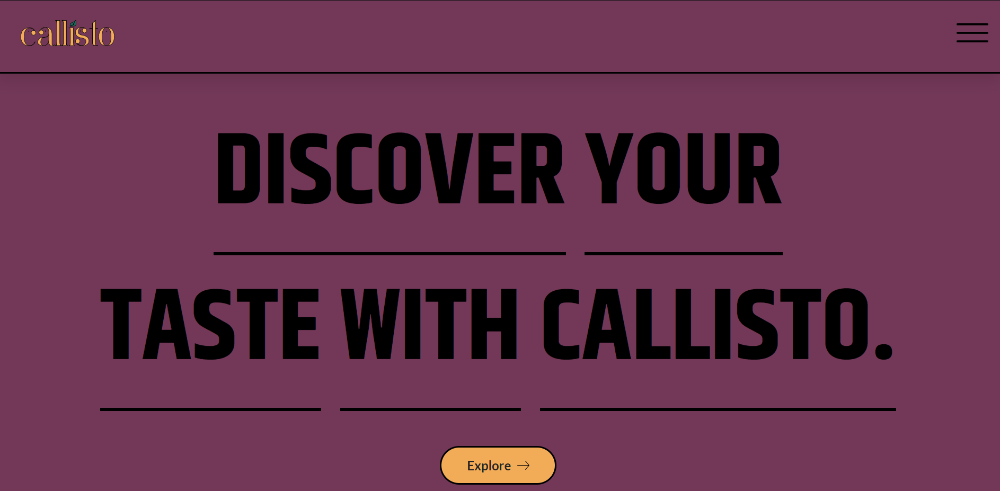

# The Callisto Project
__*A website for a fictional tea company called Callisto*__

## Table of Contents

* [Live Demo](#live-demo)
* [Technologies Used](#technologies-used)
* [Description](#description)

## Live Demo

It's currently hosted on Netlify.
__*Click on the image below to view the live site*__

## Technologies Used
- HTML
- CSS
- JavaScript: 
    - SwiperJs Library

## Description

This is my first website project as a Junior Web Developer. 
The website includes:
- A home page: that introduces the company.
- A tea gallery page: that showcases the teas the company has to offer, with the option to learn more about each tea. 
- A shop page: that allows users to add products to their cart, view their cart as well as send their orders. (Doesn't actually send the orders anywhere as it's a fake company and all).
- An about page: that gives more information about the company, their founder, their tea selection, as well as a contact us section (where users can send messages to the company's mail).
- A footer section on all pages: where users have the option to join the company's newsletter and navigate to various pages of the website. Also contains quick links to the company's (fake) social media pages as well as the copyright.
